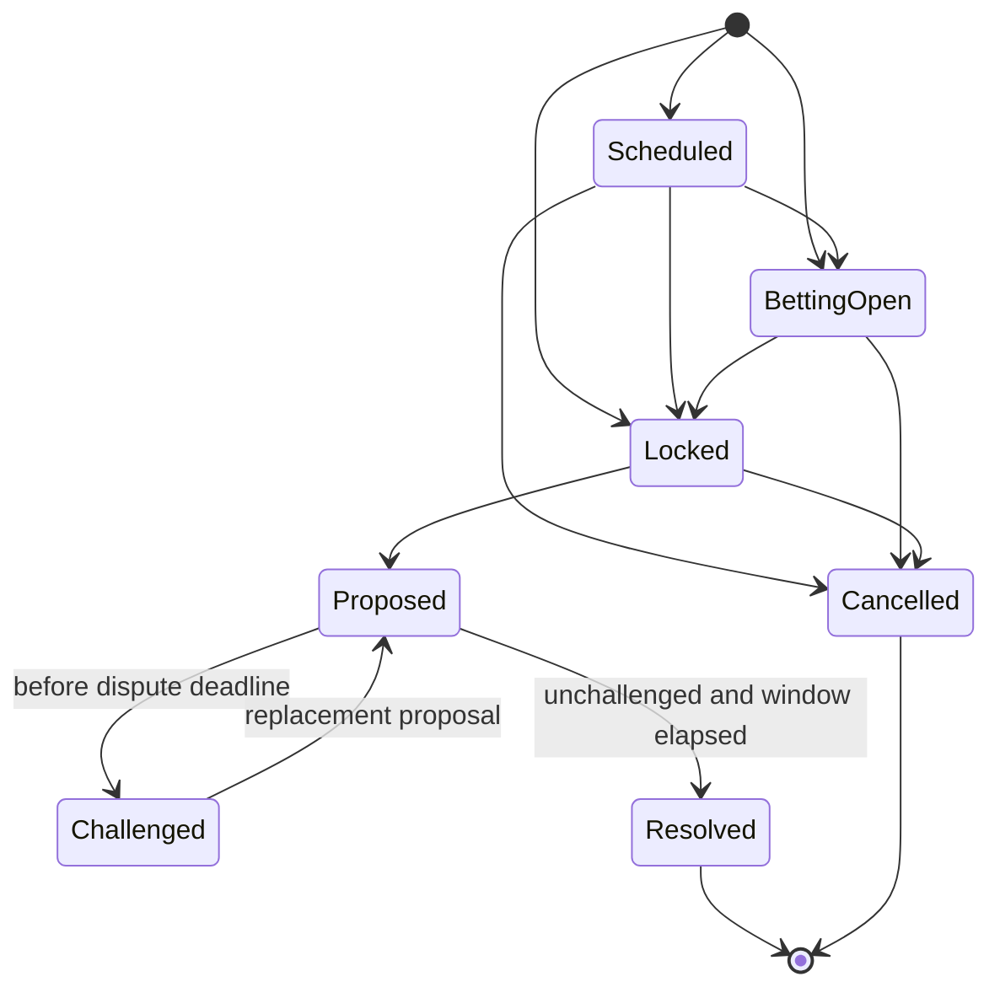
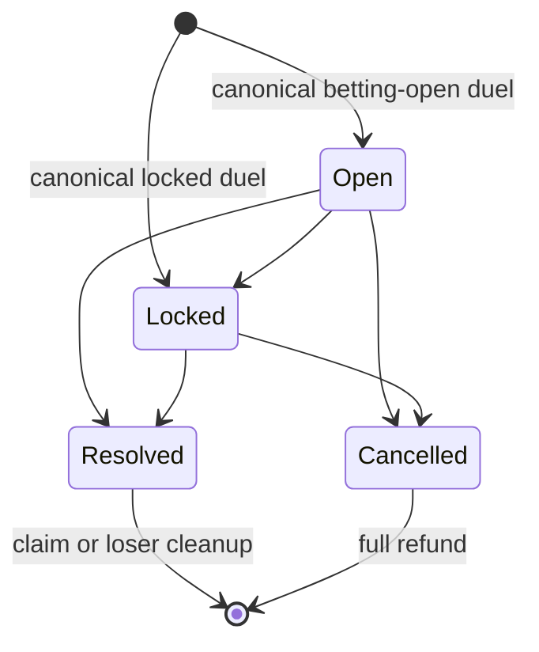
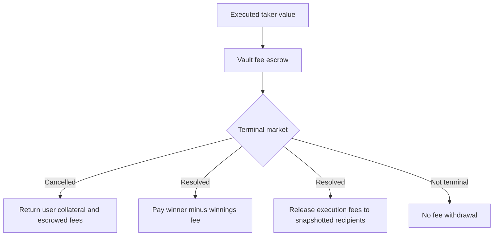

# Solana Duel and Market State Transitions

## Oracle

```mermaid
stateDiagram-v2
    [*] --> Scheduled
    [*] --> BettingOpen
    [*] --> Locked
    Scheduled --> BettingOpen
    Scheduled --> Locked
    Scheduled --> Cancelled
    BettingOpen --> Locked
    BettingOpen --> Cancelled
    Locked --> Proposed
    Locked --> Cancelled
    Proposed --> Challenged: before dispute deadline
    Proposed --> Resolved: unchallenged and window elapsed
    Challenged --> Proposed: replacement proposal
    Resolved --> [*]
    Cancelled --> [*]
```

## Market projection

```mermaid
stateDiagram-v2
    [*] --> Open: canonical betting-open duel
    [*] --> Locked: canonical locked duel
    Open --> Locked
    Open --> Resolved
    Open --> Cancelled
    Locked --> Resolved
    Locked --> Cancelled
    Resolved --> [*]: claim or loser cleanup
    Cancelled --> [*]: full refund
```

## Fee custody

```mermaid
flowchart TD
    A[Executed taker value] --> B[Vault fee escrow]
    B --> C{Terminal market}
    C -->|Cancelled| D[Return user collateral and escrowed fees]
    C -->|Resolved| E[Pay winner minus winnings fee]
    C -->|Resolved| F[Release execution fees to snapshotted recipients]
    C -->|Not terminal| G[No fee withdrawal]
```
