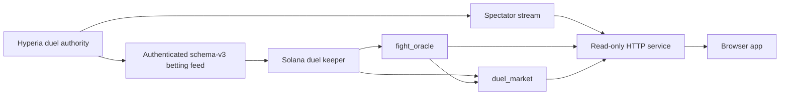

# Hyperbet Solana System Design

## Authority flow

Hyperia owns duel identity, participants, phase, timing, and terminal evidence. The authenticated betting feed is the sole settlement input. The spectator projection is display input and can never authorize settlement.

## Process boundaries

- HTTP service: read-only parser, streaming projection, accounting/history API, lifecycle index, readiness, and database; no privileged private key
- duel keeper: authenticated feed consumer plus separately configured operational signers
- browser: public configuration and user wallet only
- cold authority: deployment/configuration operations only

## Data contracts

- `duel_key` is the cross-service primary identity
- source epoch and sequence establish feed continuity
- finalized Solana instructions/events and canonical PDAs establish financial truth
- integer lamports establish value
- frozen per-market snapshots establish role and fee routing
- durable checkpoints establish replay/restart safety

## Failure posture

The system fails closed on stale source, feed gaps, program identity drift, role/config drift, unsafe market discovery, incomplete RPC history, parser lag/error, contradictory terminal evidence, database failure, or stale bot state. Read surfaces can remain available where trustworthy, but quoting and privileged writes must stop.

The v1 runtime, build, CI, deployment, and operator graph is Solana-only. Experimental repository packages outside that graph are not product dependencies.
